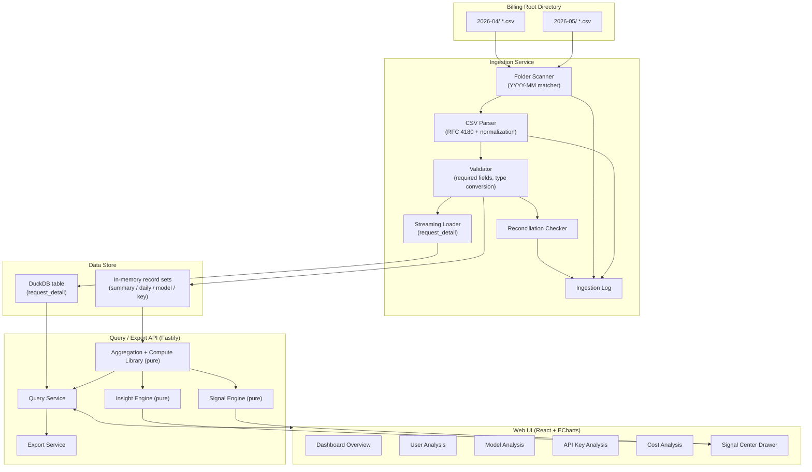
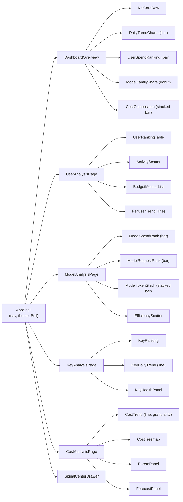

# Design Document

## Overview

The AI Usage Analytics Platform is an enterprise-internal management dashboard that turns monthly sub2api billing CSV exports into an executive cockpit for AI Gateway usage. It ingests per-month folders (e.g. `2026-04`, `2026-05`), normalizes the documented CSV schema into typed records, persists them in a queryable store, and serves aggregated metrics, trends, rankings, auto-generated insights, and risk signals to a dark-mode-first, ECharts-driven UI across six surfaces: Dashboard Overview, User Analysis, Model Analysis, API Key Analysis, Cost Analysis, and a right-side Signal Center drawer.

The design is shaped by three forcing functions drawn from the requirements and the real data:

1. **The data is mostly pre-aggregated.** Four of the five source files (`monthly_user_summary.csv`, `daily_user_usage.csv`, `model_user_usage.csv`, `api_key_usage.csv`) are small (tens of KB) and already summarized. Almost every KPI, chart, ranking, insight, and signal can be computed by pure functions over these in-memory record sets.
2. **`request_detail.csv` is large and grows unbounded.** At ~9.5 MB for a single month today (and growing), it is two orders of magnitude larger than the other files combined. It must never be fully loaded into the browser; it is streamed during ingestion and only ever queried through server-side pagination, filtering, and sorting (Requirement 3).
3. **The platform must feel active, not passive.** An Insight Engine and Signal Engine derive narrative trend insights, top-performer rankings, anomaly detection, and risk alerts (Requirements 15, 16, 17) so the dashboard reads like a management cockpit.

To make these guarantees testable, the analytical core is built as a layer of **pure, deterministic functions** (parsing/normalization, model classification, aggregation, KPI computation, forecasting, signal rules, CSV export). These functions are the source of truth for correctness and are the primary target of property-based testing. The large-file path (`request_detail`) is delegated to a columnar analytical store and is verified with example and integration tests rather than property tests.

### Technology Choices and Rationale

| Concern | Choice | Rationale |
| --- | --- | --- |
| Language | TypeScript (Node.js backend + React frontend) | Single language across the stack; strong typing for the documented CSV schema; rich PBT tooling (`fast-check`). |
| Analytical store | DuckDB (embedded) | Columnar OLAP engine that ingests CSV natively, streams `request_detail` with bounded memory, and serves paginated/filtered/sorted detail queries efficiently without a separate database server. |
| CSV parsing | `csv-parse` (streaming, RFC 4180) | Battle-tested RFC 4180 parser with a streaming interface for the large file; we do not hand-roll quoting rules. |
| Backend API | Fastify | Lightweight, fast JSON HTTP server for the Query/Export services. |
| Frontend | React + Vite + TypeScript | Component model fits the card-based, multi-page layout; fast dev/build. |
| Charts | Apache ECharts (`echarts` via a thin React wrapper) | Required by the spec; covers line, bar, donut, scatter, treemap, heatmap, and stacked charts; supports container-resize. |
| Styling/theme | Tailwind CSS with a `class`-based dark mode + CSS variables | Dark-mode-first, responsive card grid, high information density. |
| Data fetching | TanStack Query | Caches aggregates, refetches on filter change without full page reload (Requirement 19.4). |
| Tables | TanStack Table | Sortable, searchable, paginated ranking tables (Requirement 7). |
| Decimal money | `decimal.js` for parsing/summation of USD fields | The data carries up to 6 fractional digits (e.g. `433.930721`); decimal arithmetic avoids float drift in cost aggregates and reconciliation (Requirements 2.3, 21). |

> Note: This is an internal analytics tool that reads exported billing files. The backend API has no authentication layer described in the requirements; because it can expose user-level spend and request detail, deployment SHOULD restrict access at the network/reverse-proxy layer (internal-only). This is flagged as an operational concern, not a feature requirement.

## Architecture

The platform is a three-tier application: an offline-ish **Ingestion** pipeline, a **Query/Export** API backed by the **Data Store**, and a **Web UI**. The analytical computation library is shared conceptually between the API (server-side aggregation) and the engines.



### Data Flow

1. **Ingestion (Requirements 1, 2, 3, 21).** The Folder Scanner lists immediate subfolders of the configured billing root and keeps those whose names match the `YYYY-MM` pattern. For each matching folder it reads the five expected usage files. Each row is parsed (RFC 4180), normalized to typed fields, and validated; invalid rows are rejected and logged with file/row/field detail. The four small files load into in-memory record sets; `request_detail.csv` is streamed in bounded batches into a DuckDB table. The reconciliation checker compares daily-vs-monthly `used_usd` and flags cross-source mismatches. An ingestion summary (folders/files/records/rejected counts) is recorded at the end.
2. **Query (Requirements 3–14, 19).** The UI requests month-scoped aggregates. KPIs, charts, rankings, budget lists, Pareto, forecasts, and per-user/model/key breakdowns are computed by the pure Aggregation library over the in-memory record sets. `request_detail` queries (audit table, per-key daily series) go to DuckDB with pagination, conjunctive filters, and sorting.
3. **Insight & Signal generation (Requirements 15, 16, 17).** The Insight Engine and Signal Engine run the pure compute library over the aggregated data to produce top-performer rankings, trend narratives, alerts, anomalies, and risk hints, which feed the Dashboard and the Signal Center.
4. **Export (Requirement 20).** The Export Service serializes the currently filtered dataset of the active page to a CSV stream with a header row and a deterministic filename.

### Ingestion Sequence

```mermaid
sequenceDiagram
    participant Sc as Scanner
    participant P as CSV Parser
    participant V as Validator
    participant DS as Data Store
    participant L as Ingestion Log

    Sc->>Sc: list billing root (non-recursive)
    alt root unreadable
        Sc->>L: access-error; HALT
    else root readable
        loop each YYYY-MM folder
            Sc->>Sc: which of the 5 expected files exist?
            alt none present
                Sc->>L: skipped-folder entry
            else some/all present
                opt fewer than 5
                    Sc->>L: missing-file entries
                end
                loop each present file
                    Sc->>P: read file (stream for request_detail)
                    P->>V: normalized row
                    alt required field missing / bad type
                        V->>L: rejected-row (file,row,fields)
                    else valid
                        V->>V: fill billing_month from folder if empty
                        V->>DS: load record
                    end
                end
            end
        end
        DS->>L: reconciliation discrepancies
        Sc->>L: ingestion summary (folders/files/records/rejected)
    end
```

### Layering and Separation

- **Pure compute library** (`@core/compute`): classification, aggregation, KPI math, weighted averages, Pareto, forecasting, ranking, filtering/sorting helpers, signal rules, insight derivation, CSV serialization. No I/O. Deterministic. Fully property-tested.
- **Adapters** (`@core/ingest`, `@core/store`): filesystem scanning, streaming CSV, DuckDB access. Side-effecting. Verified with example/integration tests.
- **API** (`@app/api`): HTTP routing, request validation, DTO shaping.
- **UI** (`@app/web`): React pages and ECharts components; consumes API DTOs only.

This separation is what allows the bulk of the requirements to be expressed as universally-quantified properties: every metric the UI shows traces back to a pure function with a clear input/output contract.

## Components and Interfaces

### Ingestion Service

Responsible for Requirements 1, 2, 3.1, and 21.2/21.3.

```typescript
interface IngestionConfig {
  billingRootDir: string;
  requestDetailBatchSize: number; // bounded streaming batch (default 10_000 rows)
}

interface IngestionSummary {
  foldersProcessed: number;
  filesProcessed: number;
  recordsLoaded: number;
  rowsRejected: number;
}

interface IngestionService {
  run(config: IngestionConfig): Promise<IngestionResult>;
}

interface IngestionResult {
  summary: IngestionSummary;
  log: IngestionLogEntry[];
}
```

Key behaviors:
- `isValidBillingMonthFolder(name): boolean` — pure predicate matching `^\d{4}-(0[1-9]|1[0-2])$`.
- `billingMonthFromFolder(name): string` — derives Billing_Month for records whose `billing_month` field is empty (Req 1.3).
- Folder-level outcomes: skipped-folder (none of five files, Req 1.4), missing-file entries (1–4 of five, Req 1.5), access-error + halt (root unreadable, Req 1.6).
- `request_detail.csv` is read with a streaming reader and inserted into DuckDB in batches of `requestDetailBatchSize`, so peak memory is independent of row count (Req 3.1).

### CSV Parser and Normalizer

Responsible for Requirement 2. This is a pure module operating on text.

```typescript
type ParseFailure = { field: string; rawValue: string; reason: string };

interface RowResult<T> {
  record?: T;            // present when the row is accepted
  failures: ParseFailure[]; // non-empty when the row is rejected
  rowNumber: number;
}

interface FieldCodec<T> {
  parse(raw: string): { ok: true; value: T } | { ok: false; reason: string };
}

// Codecs (pure):
const moneyUsd: FieldCodec<Decimal>;     // Req 2.3
const tokenCount: FieldCodec<number>;    // Req 2.4 (non-negative integer)
const timestampTz: FieldCodec<Date>;     // Req 2.5 (offset preserved, else UTC)
const streamBool: FieldCodec<boolean>;   // Req 2.6 (t/true/1, f/false/0)
const text: FieldCodec<string | null>;   // Req 2.7/2.8 (trim; empty -> null)
```

Parsing pipeline per file:
1. Treat row 0 as header; map columns by header name (Req 2.1).
2. Split fields using RFC 4180 quoting (Req 2.2) — delegated to `csv-parse`.
3. Trim every value; whitespace-only becomes empty (Req 2.7).
4. Apply the field codec for each column; non-required empties become `null` (Req 2.8).
5. Required fields per record type are enforced (Req 2.10): `user_id` always; `usage_date` for daily; `model` for model usage; `api_key_id` for key usage; `request_id` for request detail.
6. If any required field is empty or any field fails conversion, evaluate all remaining fields, then reject the row and record every failing field with its raw value (Req 2.9). Otherwise produce a normalized record that exposes all documented source fields (Req 2.11).

### Data Store

```typescript
interface DataStore {
  // Small, pre-aggregated record sets held in memory, indexed by Billing_Month.
  monthlySummaries(month: string): MonthlySummaryRecord[];
  dailyUsage(month: string): DailyUsageRecord[];
  modelUsage(month: string): ModelUsageRecord[];
  keyUsage(month: string): KeyUsageRecord[];
  availableMonths(): string[]; // ascending YYYY-MM

  // Large file: server-side query only.
  queryRequestDetail(q: RequestDetailQuery): Promise<RequestDetailPage>;
}
```

The four small sets are kept in memory because their combined size is trivial and pure aggregation over arrays is the cleanest, most testable query path. `request_detail` lives only in DuckDB.

### Query Service

Serves Requirements 3.2–3.8 and is the HTTP surface for all aggregates. Aggregates are computed by the pure library; only request-detail queries hit DuckDB.

```typescript
interface RequestDetailQuery {
  billingMonth: string;          // REQUIRED (Req 3.3)
  userId?: string;
  model?: string;
  apiKeyId?: string;
  dateRange?: { start: Date; end: Date }; // inclusive (Req 3.4, 19.2)
  sortBy?: 'total_cost_usd' | 'duration_ms' | 'created_at'; // default created_at (Req 3.5)
  sortDir?: 'asc' | 'desc';      // default desc
  page?: number;                 // 1-based
  pageSize?: number;             // 1..1000, default 100 (Req 3.2)
}

interface RequestDetailPage {
  records: RequestDetailRecord[];
  totalCount: number;            // matching records (Req 3.7)
  totalPages: number;            // ceil(totalCount / pageSize) (Req 3.7)
  page: number;
  pageSize: number;
}
```

- Missing `billingMonth` → error response, no records (Req 3.3).
- Filters combine conjunctively (AND) before pagination (Req 3.4).
- Page beyond `totalPages` → empty `records` with correct `totalCount`/`totalPages` (Req 3.8).

### Aggregation and Compute Library (pure)

The heart of the analytical correctness. Representative signatures:

```typescript
// Model family classification (Req 6)
type ModelFamily = 'GPT' | 'Claude' | 'Gemini' | 'Other';
function classifyModelFamily(modelName: string): ModelFamily;

// KPI metrics (Req 4)
interface DashboardKpis {
  totalSpendUsd: Decimal;
  activeUserCount: number;
  totalRequestCount: number;
  totalTokenCount: number;
  totalApiKeyCount: number;
  avgResponseMs: number;          // request-weighted
  budgetUsageRatePct: number;     // rounded to 1 dp
  comparison?: KpiComparison;     // vs preceding month (Req 4.10)
}
function computeDashboardKpis(
  current: MonthlySummaryRecord[],
  preceding?: MonthlySummaryRecord[],
): DashboardKpis;

// Generic helpers reused across pages
function sumField<T>(rows: T[], pick: (r: T) => Decimal): Decimal;
function weightedAvg<T>(rows: T[], value: (r: T) => number, weight: (r: T) => number): number;
function groupSum<T, K>(rows: T[], key: (r: T) => K, metric: (r: T) => Decimal): Map<K, Decimal>;
function topN<T>(rows: T[], metric: (r: T) => number, n: number): T[]; // sorted desc, size <= n
function displayLabel(username: string | null, email: string | null): string; // Req 5.2/7.5

// Budget (Req 9, 4.8)
function usagePercent(usedUsd: Decimal, limitUsd: Decimal): number;
type BudgetStyle = 'normal' | 'warning' | 'critical';
function budgetStyle(usagePct: number): BudgetStyle; // <80 normal, [80,95) warning, >=95 critical

// Pareto + forecast (Req 14)
function paretoShares(spends: Decimal[]): { top10: number; top20: number; top30: number };
function forecastMonthEnd(daily: DailyUsageRecord[], month: string): ForecastResult | InsufficientData;
```

### Insight Engine (pure)

Requirement 15.

```typescript
interface Insight {
  id: string;
  text: string;              // short statement (Req 15.4)
  metricValue: number | string;
  kind: 'top_performer' | 'trend';
}

function topPerformers(summaries: MonthlySummaryRecord[]): TopPerformerRanking | null; // null if all zero (Req 15.2)
function trendInsights(current: MonthlySummaryRecord[], preceding: MonthlySummaryRecord[]): Insight[]; // Req 15.3
```

### Signal Engine (pure)

Requirements 16, 17.

```typescript
type Severity = 'informational' | 'warning' | 'critical';
type SignalGroup =
  | 'high_spend' | 'low_balance' | 'api_key_anomaly'
  | 'response_time_anomaly' | 'risk_hint';

interface Signal {
  id: string;
  group: SignalGroup;
  severity: Severity;        // Req 17.6
  message: string;
  target: { page: string; entityId: string }; // navigation target (Req 16.5)
  read: boolean;
}

function detectSignals(input: {
  summaries: MonthlySummaryRecord[];
  daily: DailyUsageRecord[];
  keyDailyRequestCounts: Map<string, number[]>;
}): Signal[];
```

Rules: single-day spend > 20% of limit → high-spend (17.1); remaining ≤ 10% of limit → low-balance (17.2); key single-day requests > 3× key daily average → api-key anomaly (17.3); `avg_duration_ms` > 60000 → response-time anomaly (17.4); high-spend on ≥2 consecutive days → risk hint (17.5).

### Export Service

Requirement 20.

```typescript
interface ExportRequest {
  pageName: string;
  billingMonth: string;
  rows: Record<string, unknown>[]; // currently filtered data
  columns: string[];               // header names matching the view (Req 20.2)
}
function buildCsvExport(req: ExportRequest): { filename: string; content: string };
// filename: `${pageName}_${billingMonth}_${timestamp}.csv` (Req 20.3)
// empty rows -> header-only content (Req 20.5)
```

### Web UI Components

All pages share a `BillingMonthSelector`, `DateRangeFilter`, `SearchBox`, `ExportButton`, theme toggle, and the `SignalCenterDrawer` triggered by a Bell icon with an unread-count badge.



Each ECharts component subscribes to a resize observer on its card so charts re-fit on viewport change (Req 18.6). The `AppShell` applies a responsive card grid: multi-column ≥768px, single-column collapsed-nav for 320–768px, single-column with horizontal scroll <320px (Req 18.3–18.5), and a `class`-based dark theme defaulting to dark and persisted to `localStorage` (Req 18.1–18.2).

## Data Models

### Normalized Record Types

Money fields use `Decimal` (decimal.js) to preserve the up-to-6-digit fractional precision seen in the data; token/count fields are integers; timestamps are timezone-aware `Date`s. `null` denotes an empty non-required field.

```typescript
interface MonthlySummaryRecord {
  billing_month: string;            // YYYY-MM (required)
  user_id: string;                  // required
  email: string | null;
  username: string | null;
  wechat: string | null;
  notes: string | null;
  role: string | null;
  status: string | null;
  current_balance_usd: Decimal | null;
  monthly_limit_usd: Decimal | null;
  used_usd: Decimal | null;
  remaining_monthly_limit_usd: Decimal | null;
  usage_percent: number | null;
  request_count: number | null;
  api_key_count: number | null;
  active_days: number | null;
  input_tokens: number | null;
  output_tokens: number | null;
  cache_creation_tokens: number | null;
  cache_read_tokens: number | null;
  image_output_tokens: number | null;
  image_count: number | null;
  input_cost_usd: Decimal | null;
  output_cost_usd: Decimal | null;
  cache_creation_cost_usd: Decimal | null;
  cache_read_cost_usd: Decimal | null;
  image_output_cost_usd: Decimal | null;
  actual_cost_usd: Decimal | null;
  avg_duration_ms: number | null;
  avg_first_token_ms: number | null;
  first_request_at: Date | null;
  last_request_at: Date | null;
}

interface DailyUsageRecord {
  billing_month: string;            // required
  usage_date: Date;                 // required
  user_id: string;                  // required
  email: string | null;
  username: string | null;
  request_count: number | null;
  used_usd: Decimal | null;
  input_tokens: number | null;
  output_tokens: number | null;
  cache_read_tokens: number | null;
  image_output_tokens: number | null;
  avg_duration_ms: number | null;
}

interface ModelUsageRecord {
  billing_month: string;            // required
  user_id: string;                  // required
  email: string | null;
  username: string | null;
  model: string;                    // required
  request_count: number | null;
  used_usd: Decimal | null;
  input_tokens: number | null;
  output_tokens: number | null;
  cache_creation_tokens: number | null;
  cache_read_tokens: number | null;
  image_output_tokens: number | null;
  avg_duration_ms: number | null;
}

interface KeyUsageRecord {
  billing_month: string;            // required
  user_id: string;                  // required
  email: string | null;
  username: string | null;
  api_key_id: string;               // required
  api_key_name: string | null;
  api_key_status: string | null;
  api_key_deleted: boolean | null;
  request_count: number | null;
  used_usd: Decimal | null;
  input_tokens: number | null;
  output_tokens: number | null;
  first_request_at: Date | null;
  last_request_at: Date | null;
}

interface RequestDetailRecord {
  billing_month: string;            // required
  created_at: Date | null;
  user_id: string;                  // required
  email: string | null;
  username: string | null;
  api_key_id: string;               // required
  api_key_name: string | null;
  request_id: string;               // required
  model: string | null;
  inbound_endpoint: string | null;
  upstream_endpoint: string | null;
  input_tokens: number | null;
  output_tokens: number | null;
  cache_creation_tokens: number | null;
  cache_read_tokens: number | null;
  image_output_tokens: number | null;
  image_count: number | null;
  total_cost_usd: Decimal | null;
  actual_cost_usd: Decimal | null;
  duration_ms: number | null;
  first_token_ms: number | null;
  stream: boolean | null;
  ip_address: string | null;
  user_agent: string | null;
}
```

### Ingestion Log and Engine Models

```typescript
type IngestionLogEntry =
  | { type: 'skipped_folder'; folder: string }
  | { type: 'missing_file'; folder: string; file: string }
  | { type: 'access_error'; path: string; detail: string }
  | { type: 'rejected_row'; file: string; rowNumber: number; failures: ParseFailure[] }
  | { type: 'reconciliation'; userId: string; month: string; dailySum: string; monthly: string }
  | { type: 'unmatched_reference'; requestId: string; apiKeyId: string; month: string }
  | { type: 'summary'; summary: IngestionSummary };

interface ForecastResult {
  projectedMonthEndSpendUsd: Decimal;
  projectedDaysToBudget: number;
  overBudget: boolean;
}
type InsufficientData = { insufficient: true }; // < 3 days of daily records (Req 14.5)
```

### DuckDB Schema (request_detail)

```sql
CREATE TABLE request_detail (
  billing_month        VARCHAR NOT NULL,
  created_at           TIMESTAMPTZ,
  user_id              VARCHAR NOT NULL,
  email                VARCHAR,
  username             VARCHAR,
  api_key_id           VARCHAR NOT NULL,
  api_key_name         VARCHAR,
  request_id           VARCHAR NOT NULL,
  model                VARCHAR,
  inbound_endpoint     VARCHAR,
  upstream_endpoint    VARCHAR,
  input_tokens         BIGINT,
  output_tokens        BIGINT,
  cache_creation_tokens BIGINT,
  cache_read_tokens    BIGINT,
  image_output_tokens  BIGINT,
  image_count          BIGINT,
  total_cost_usd       DECIMAL(18,6),
  actual_cost_usd      DECIMAL(18,6),
  duration_ms          BIGINT,
  first_token_ms       BIGINT,
  stream               BOOLEAN,
  ip_address           VARCHAR,
  user_agent           VARCHAR
);
CREATE INDEX idx_rd_month ON request_detail(billing_month);
CREATE INDEX idx_rd_filter ON request_detail(billing_month, user_id, api_key_id, model);
```

## Correctness Properties

*A property is a characteristic or behavior that should hold true across all valid executions of a system — essentially, a formal statement about what the system should do. Properties serve as the bridge between human-readable specifications and machine-verifiable correctness guarantees.*

This feature is well-suited to property-based testing because its analytical core is a layer of pure, deterministic functions (CSV parsing/normalization, model-family classification, aggregation, KPI math, ranking, filtering, pagination, Pareto/forecast, signal rules, and CSV export) with large input spaces and universal invariants such as round-trips, summation invariants, and threshold rules. Infrastructure paths (filesystem scanning, `request_detail` streaming, DuckDB wiring) and UI rendering/layout are validated by example, integration, and smoke tests instead (see Testing Strategy).

**Parsing, Normalization, and Ingestion**

### Property 1: Model family classification is total and rule-consistent

*For any* model name string, `classifyModelFamily` returns exactly one of GPT, Claude, Gemini, or Other; it returns GPT when the name begins with `gpt` or `codex`, Claude when the name contains `claude`, Gemini when the name contains `gemini` (applying the documented precedence), and Other when no rule matches.

**Validates: Requirements 6.1, 6.2, 6.3, 6.4**

### Property 2: Monetary fields parse to precise decimals or fail

*For any* string consisting of an optional sign, digits, and at most one decimal separator, the monetary codec produces a USD decimal equal to that value preserving its fractional digits; *for any* other non-empty string the codec reports a conversion failure.

**Validates: Requirements 2.3**

### Property 3: Token and count fields parse to non-negative integers or fail

*For any* non-negative integer string the token/count codec produces the corresponding integer; *for any* negative, fractional, or non-numeric non-empty string the codec reports a conversion failure.

**Validates: Requirements 2.4**

### Property 4: Timestamp parsing preserves offset or assumes UTC

*For any* timestamp string that includes a UTC offset, the timestamp codec produces an instant equal to the value at that offset; *for any* timestamp string without an offset, the codec produces the instant interpreting the value as UTC.

**Validates: Requirements 2.5**

### Property 5: Stream boolean parsing maps accepted tokens and rejects others

*For any* case variation and surrounding whitespace of `t`/`true`/`1` the stream codec returns true, *for any* case variation and surrounding whitespace of `f`/`false`/`0` it returns false, and *for any* other non-empty value it reports a conversion failure.

**Validates: Requirements 2.6**

### Property 6: Whitespace is trimmed and empty optional fields become null

*For any* field value, parsing trims leading and trailing whitespace, treats a value that is empty or whitespace-only as empty, and stores null for an empty non-required field.

**Validates: Requirements 2.7, 2.8**

### Property 7: Invalid rows are rejected and report every failing field

*For any* row in which one or more values fail type conversion or one or more required fields (per record type) are empty, the parser rejects the row and the recorded failure list contains exactly the offending field names paired with their raw values, having still evaluated the remaining fields.

**Validates: Requirements 2.9, 2.10**

### Property 8: CSV serialize/parse round-trip preserves the record schema

*For any* valid record of a given type (including string fields containing commas, quotes, or newlines), serializing it to a CSV row and parsing it back — with header columns in any order — yields an equivalent record exposing every documented field under its documented name.

**Validates: Requirements 2.1, 2.2, 2.11**

### Property 9: Billing_Month falls back to the folder name

*For any* record whose `billing_month` value is empty or whitespace-only ingested from a folder named `YYYY-MM`, the loaded record's Billing_Month equals the folder-derived month; a record with a populated `billing_month` retains its own value.

**Validates: Requirements 1.3**

### Property 10: Records are partitioned by Billing_Month across folders

*For any* set of records spanning multiple months loaded into the Data_Store, a month-scoped query for month M returns exactly the records whose Billing_Month equals M, and every loaded record retains its Billing_Month.

**Validates: Requirements 1.8**

**Aggregation and KPI Computation**

### Property 11: Additive aggregates equal the sum of their source field

*For any* set of Monthly_Summary_Records, total Spend equals the decimal sum of `used_usd`, total token count equals the sum of the five token fields, total request count equals the sum of `request_count`, total API key count equals the sum of `api_key_count`, and each cost-composition segment equals the sum of its corresponding per-category cost field.

**Validates: Requirements 4.2, 4.4, 4.5, 4.6, 5.4**

### Property 12: Active user count counts distinct active users

*For any* set of Monthly_Summary_Records, the active user count equals the number of distinct `user_id` values whose `request_count` is greater than or equal to 1.

**Validates: Requirements 4.3**

### Property 13: Request-weighted averages follow the weighted-average formula

*For any* set of records with per-record `avg_duration_ms` and `request_count`, the computed average response time equals the sum of `avg_duration_ms` times `request_count` divided by the sum of `request_count` (both at the dashboard grain over summaries and the per-model grain over Model_Usage_Records), and equals 0 when the total request count is 0.

**Validates: Requirements 4.7, 11.5**

### Property 14: Budget usage rate equals the bounded, rounded ratio

*For any* set of Monthly_Summary_Records, the monthly budget usage rate equals total Spend divided by the sum of `monthly_limit_usd`, times 100, rounded to one decimal place, and equals 0 when the sum of `monthly_limit_usd` is 0.

**Validates: Requirements 4.8, 4.9**

### Property 15: KPI percentage change equals relative delta or signals no comparison

*For any* current and preceding KPI value, the displayed change equals the current minus the preceding divided by the preceding times 100 when the preceding value is non-zero, and is the no-comparison indicator when the preceding value is 0.

**Validates: Requirements 4.10**

### Property 16: Dimensional group-sums preserve totals

*For any* set of records grouped by a dimension (Model_Family, model, API key, or treemap level user→model→key), the sum of each group's metric equals the sum of that metric across the group's member records, and the sum across all groups equals the grand total of that metric.

**Validates: Requirements 5.3, 11.1, 11.2, 11.3, 12.1, 13.4**

### Property 17: Time-bucketed trends sum per bucket in ascending order

*For any* set of dated usage records and a chosen granularity (daily by `usage_date`, weekly, or monthly by Billing_Month), the trend series contains one point per occupied bucket ordered ascending by time, and each point's value equals the sum of the metric over the records in that bucket — including when records are pre-filtered to a single user or a single API key.

**Validates: Requirements 5.1, 10.1, 12.2, 12.3, 13.1, 13.2, 13.3**

**Ranking, Filtering, and Pagination**

### Property 18: Top-N ranking is bounded, descending, and complete when small

*For any* set of records and limit N, the top-N ranking by the chosen metric is sorted in descending order, contains at most N entries, contains every record when fewer than N exist, and selects the N highest-metric records.

**Validates: Requirements 5.2, 12.5**

### Property 19: Display label falls back from username to email

*For any* record, the display label is the `username` when it is non-empty and the `email` otherwise.

**Validates: Requirements 5.2, 7.5**

### Property 20: Sorting orders rows by the selected column and direction

*For any* set of rows and any selectable column and direction, the sorted output is a permutation of the input ordered non-decreasingly (ascending) or non-increasingly (descending) by that column; the budget monitoring list is ordered by Usage_Percent descending and the request-detail default order is `created_at` descending.

**Validates: Requirements 3.5, 7.2, 9.4**

### Property 21: Case-insensitive search returns exactly the matching rows

*For any* set of rows and any search text, the filtered result contains exactly the rows whose `username` or `email` contains the text under case-insensitive matching.

**Validates: Requirements 7.3**

### Property 22: Pagination partitions the ordered result with correct totals

*For any* ordered result set, page size in the range 1 to 1000, and page number, the returned page contains at most page-size records, `totalCount` equals the number of records matching the applied filters, `totalPages` equals the ceiling of `totalCount` divided by page size, concatenating all in-range pages reproduces the full ordered set, and a page number beyond `totalPages` yields an empty page with the same `totalCount` and `totalPages`.

**Validates: Requirements 3.2, 3.7, 3.8, 7.4**

### Property 23: Request-detail filters combine conjunctively

*For any* set of Request_Detail_Records and any combination of user, model, API key, and Date_Range_Filter criteria, every returned record satisfies all provided criteria and no record satisfying all of them is omitted.

**Validates: Requirements 3.4, 4.3**

### Property 24: Date-range filtering is inclusive

*For any* set of dated records and a Date_Range_Filter with start on or before end, the constrained set contains exactly the records whose date is greater than or equal to the start and less than or equal to the end.

**Validates: Requirements 19.2**

### Property 25: Date ranges with start after end are rejected

*For any* Date_Range_Filter, the selection is rejected if and only if the start date is later than the end date.

**Validates: Requirements 19.3**

### Property 26: Scatter mapping is one point per entity with correct coordinates

*For any* set of per-entity records (users or models), the scatter dataset contains exactly one point per entity whose X and Y coordinates equal that entity's defined axis metrics, and the point size is a monotonic non-decreasing function of the entity's total token count.

**Validates: Requirements 8.1, 8.2, 11.4**

**Budget, Pareto, and Forecast**

### Property 27: Budget style follows the usage-percent thresholds

*For any* Usage_Percent value, the budget style is normal below 80, the yellow warning style on the interval from 80 inclusive to 95 exclusive, and the red warning style at 95 or above.

**Validates: Requirements 9.2, 9.3**

### Property 28: Pareto cumulative shares are monotonic and bounded

*For any* non-empty set of user spends, the cumulative spend shares for the top 10, 20, and 30 percent of users (ranked by Spend descending) are each at least 0 and at most 100, and satisfy top-10 ≤ top-20 ≤ top-30.

**Validates: Requirements 14.1**

### Property 29: Month-end forecast extrapolates the daily rate

*For any* set of Daily_Usage_Records spanning at least 3 distinct days within a Billing_Month, the projected month-end Spend equals the observed cumulative Spend plus the average daily Spend multiplied by the number of remaining days in the month, the projected days-to-budget equals the remaining aggregate budget divided by the average daily Spend, and the over-budget indicator is set exactly when the projected month-end Spend exceeds the aggregate Monthly_Budget_Limit.

**Validates: Requirements 14.2, 14.3, 14.4**

**Key Health and Reconciliation**

### Property 30: Long-unused keys are exactly those idle beyond 14 days

*For any* set of Key_Usage_Records and a selected Billing_Month, a key is classified as long-unused if and only if its `last_request_at` is more than 14 days before the end of that month.

**Validates: Requirements 12.4**

### Property 31: Abnormal-growth keys exceed the 200 percent threshold

*For any* API key with request counts in a Billing_Month and its immediately preceding Billing_Month, the key is classified as abnormal-growth if and only if its request count increased by at least 200 percent relative to the preceding month.

**Validates: Requirements 12.6**

### Property 32: Daily records reconcile to the monthly summary

*For any* user and Billing_Month, the Daily_Usage_Records are associated with the matching Monthly_Summary_Record by `user_id` and Billing_Month, and a reconciliation discrepancy is recorded if and only if the sum of the daily `used_usd` differs from the summary `used_usd` by more than 1 percent.

**Validates: Requirements 21.1, 21.2**

### Property 33: Unmatched API key references are retained and logged

*For any* Request_Detail_Record whose `api_key_id` has no matching Key_Usage_Record for the same Billing_Month, an unmatched-reference entry is recorded and the Request_Detail_Record remains available for query.

**Validates: Requirements 21.3**

**Insights and Signals**

### Property 34: Top-performer rankings are produced when data is non-trivial and ordered

*For any* set of Monthly_Summary_Records in which at least one user has non-zero Spend, request count, or token count, the Insight_Engine produces top-performer rankings by Spend, request count, and token count, each ordered in descending order of its metric.

**Validates: Requirements 15.1**

### Property 35: Trend insights match the computed change

*For any* current and preceding month aggregates, each generated trend insight for total Spend, active users, and total requests states a direction equal to the sign of (current minus preceding) and a magnitude equal to the computed change between the two months.

**Validates: Requirements 15.3**

### Property 36: High-spend alerts trigger above 20 percent of limit

*For any* user's Daily_Usage_Records and `monthly_limit_usd`, a high-spend alert is produced for a day if and only if that day's Spend exceeds 20 percent of the user's Monthly_Budget_Limit, and each alert identifies the user, the date, and the day's Spend.

**Validates: Requirements 17.1**

### Property 37: Low-balance alerts trigger at or below 10 percent remaining

*For any* user, a low-balance alert is produced if and only if `remaining_monthly_limit_usd` is less than or equal to 10 percent of `monthly_limit_usd`, and the alert identifies the user and the remaining amount.

**Validates: Requirements 17.2**

### Property 38: API key anomalies trigger above 3x the daily average

*For any* API key's sequence of daily request counts within a Billing_Month, an API key anomaly is produced for a day if and only if that day's request count exceeds 3 times the key's average daily request count for the month, and the anomaly identifies the key, the owning user, and the date.

**Validates: Requirements 17.3**

### Property 39: Response-time anomalies trigger above the 60000 ms threshold

*For any* user, a response-time anomaly is produced if and only if the user's `avg_duration_ms` exceeds 60000 milliseconds, and the anomaly identifies the user and the average response time.

**Validates: Requirements 17.4**

### Property 40: Risk hints trigger on consecutive high-spend days

*For any* user's sequence of daily high-spend determinations within a Billing_Month, a risk hint is produced if and only if there exist 2 or more consecutive high-spend days, and the hint reports the maximal consecutive-day count.

**Validates: Requirements 17.5**

### Property 41: Every signal carries a group and severity determined by its rule

*For any* detection input, every produced signal is assigned the group of the rule that produced it (high-spend, low-balance, API key anomaly, response-time anomaly, or risk hint) and a severity of informational, warning, or critical fixed by that rule.

**Validates: Requirements 16.2, 17.6**

### Property 42: The unread badge equals the count of unread signals

*For any* list of signals with read/unread states, the Bell badge count equals the number of signals whose state is unread.

**Validates: Requirements 16.3**

**Export**

### Property 43: CSV export round-trips the filtered rows under the displayed header

*For any* set of rows and ordered column list, the exported CSV begins with a header row equal to the column list and parsing the export recovers the original row values in order; when the row set is empty the export contains only the header row.

**Validates: Requirements 20.1, 20.2, 20.5**

## Error Handling

The platform distinguishes recoverable data issues (logged, processing continues) from fatal conditions (halt) and from query-time client errors (rejected with an explicit response).

### Ingestion-time errors

| Condition | Handling | Requirement |
| --- | --- | --- |
| Billing root missing/unreadable | Record `access_error` log entry; halt the run; load no records | 1.6 |
| Folder matches `YYYY-MM` but contains none of the five files | Record `skipped_folder`; continue scanning | 1.4 |
| Folder contains 1–4 of the five files | Process present files; record `missing_file` per absent file; continue | 1.5 |
| Row has a failed conversion or empty required field | Evaluate all fields, reject the row, record `rejected_row` with file/row/failing fields and raw values; continue with next row | 2.9, 2.10 |
| Empty `billing_month` field | Fall back to folder-derived month | 1.3 |
| Daily vs monthly `used_usd` mismatch > 1% | Record `reconciliation` entry; keep both records | 21.2 |
| `request_detail` references unknown `api_key_id` | Record `unmatched_reference`; retain the detail record | 21.3 |

Every ingestion run ends with a `summary` log entry (folders/files/records/rejected counts), so a run is never silently partial (Req 1.7). The ingestion log is structured (typed entries) so it can be surfaced in an operator view and asserted in tests.

### Query-time errors

- **Missing Billing_Month on a request-detail query** → reject with an error response and return no records (Req 3.3). This is enforced before any DuckDB access.
- **Page beyond range** → not an error; return an empty page with correct `totalCount`/`totalPages` (Req 3.8).
- **Invalid date range (start > end)** → reject the filter selection and surface a validation message; the previous valid view is retained (Req 19.3).
- **Out-of-bounds page size** → clamp to the 1–1000 range; the default of 100 applies when unspecified (Req 3.2).

### Render-time / empty-state handling

- Charts with no source records for the selected month render an explicit empty-state message rather than a blank canvas (Req 5.5), and the per-user trend section distinguishes "present but all-zero" (render zero lines, Req 10.2) from "no records" (empty state, Req 10.3).
- The forecast renders an insufficient-data message and suppresses the over-budget indicator when fewer than 3 days of daily records exist (Req 14.5).
- Top-performer rankings and individual insights are omitted (not shown as placeholders) when their inputs are unavailable or all-zero (Req 15.2, 15.5).

### UI resilience

- Export must complete even if the progress indicator fails to render (Req 20.4); the export computation is independent of the indicator component, which is wrapped so a render fault cannot abort the download.
- Monetary aggregation never performs currency conversion; all USD fields are summed as-is in decimal arithmetic (Req 21.4).

## Testing Strategy

The platform uses a dual approach: property-based tests verify universal invariants of the pure analytical core, and example/integration/smoke tests cover infrastructure, UI, and specific scenarios.

### Property-Based Testing

- **Library**: `fast-check` (TypeScript), integrated with the unit test runner (Vitest). Property-based testing is not implemented from scratch.
- **Iterations**: each property test runs a minimum of 100 generated cases (`fc.assert(..., { numRuns: 100 })` or higher).
- **Traceability**: each property test is tagged with a comment referencing its design property in the form:
  `// Feature: ai-usage-analytics, Property {number}: {property_text}`
- **Coverage**: Properties 1–43 above each map to a single property-based test.
- **Generators**: custom `fast-check` arbitraries produce realistic records — `Decimal` monetary values with up to 6 fractional digits, non-negative token integers, timezone-aware timestamps (with and without offsets), model names spanning all four families, strings containing commas/quotes/newlines/whitespace for CSV round-trips, and multi-month record sets. Edge cases identified in prework (empty required fields per record type 2.10, all-zero users 15.2, division-by-zero limits 4.9, <3 days for forecast 14.5, page-beyond-range 3.8, deleted keys 12.7) are folded into these generators so the property runs exercise them.

### Example-Based Unit Tests

Used where behavior is specific rather than universal:
- KPI card presence and table column presence on render (4.1, 7.1).
- Scatter/budget tooltips and list rendering (8.3, 9.1).
- Insight output shape — text plus supporting metric value (15.4).
- Export filename format `pageName_month_timestamp.csv` (20.3).
- Empty-state and insufficient-data renders (5.5, 10.2, 10.3, 14.5), deleted-key indicator (12.7), and the missing-Billing_Month query guard (3.3).

### Integration Tests

Used for filesystem and large-file infrastructure where input variation adds little and cost is high:
- Folder discovery against fixture directories: reading all five present files (1.2), skipped-folder (1.4), missing-file (1.5), access-error/halt (1.6), and ingestion-summary counts (1.7).
- `request_detail.csv` streaming ingestion with bounded memory that does not scale with row count (3.1), verified by ingesting a large generated fixture and observing peak memory.
- End-to-end DuckDB query path for paginated/filtered/sorted request detail with 1–3 representative datasets.

### Smoke Tests

Single-execution checks for architectural constraints:
- Dashboard aggregate endpoints read from summary record sets / server-side aggregation rather than a full client-side load of `request_detail` (3.6).
- A single shared `classifyModelFamily` function is used across the Dashboard, Model, and Cost pages (6.5).
- Monetary aggregation performs no currency conversion (21.4).

### UI and Responsive Tests

Component and interaction tests (React Testing Library) plus viewport checks:
- Dark-mode default and persistence (18.1, 18.2), responsive breakpoints (18.3–18.5), and ECharts resize-on-container-change (18.6).
- Signal Center open/close on Bell activation and signal-click navigation (16.1, 16.4, 16.5).
- Filter/search/date reactivity without full reload and clear-filters reset to latest month (19.1, 19.4, 19.5).
- Export progress indicator with resilience to indicator render failure (20.4).
